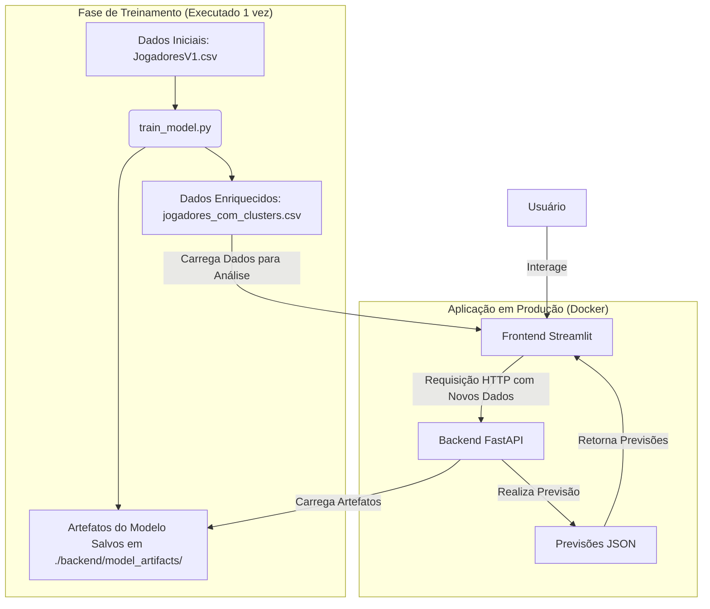

# Dashboard de Análise e Previsão de Jogadores

Este projeto consiste em uma solução completa de Machine Learning, incluindo uma API de backend (FastAPI) para previsões e um dashboard interativo (Streamlit) para análise de dados e interação com os modelos.

## Arquitetura do Sistema

O sistema é composto por três componentes principais: um script de treinamento, um backend para servir o modelo e um frontend para interação do usuário.



## Estrutura de Pastas

```
Desafio-final/
├── backend/
│   ├── main.py              # Lógica da API FastAPI
│   ├── requirements.txt     # Dependências do backend
│   ├── Dockerfile           # Dockerfile do backend
│   └── model_artifacts/     # Modelos e artefatos (gerado pelo train_model.py)
├── frontend/
│   ├── dashboard.py         # Lógica do Dashboard Streamlit
│   ├── requirements.txt     # Dependências do frontend
│   ├── Dockerfile           # Dockerfile do frontend
│   └── jogadores_com_clusters.csv # Dados para visualização (gerado)
├── train_model.py           # Script para treinar os modelos
├── JogadoresV1.csv          # Dados brutos de treinamento
├── docker-compose.yml       # Orquestrador dos contêineres
└── README.md                # Este arquivo
```

## Guia de Instalação e Execução

### Pré-requisitos

- Docker e Docker Compose instalados
- O arquivo de dados `JogadoresV1.csv` deve estar na pasta raiz do projeto

### Passo 1: Treinamento do Modelo (Apenas uma vez)

Antes de iniciar a aplicação com Docker, é necessário treinar os modelos e gerar os artefatos. Este passo deve ser executado localmente.

1. **Instale as dependências de treinamento:**
   ```bash
   pip install pandas scikit-learn lightgbm joblib numpy
   ```

2. **Execute o script de treinamento:**
   ```bash
   python train_model.py
   ```

> **Importante:** Este comando irá criar a pasta `backend/model_artifacts` com todos os modelos, scalers e configurações necessárias, além do arquivo `frontend/jogadores_com_clusters.csv`.

### Passo 2: Configuração da Chave de API

A API é protegida por uma chave. Crie um arquivo chamado `.env` na raiz do projeto e adicione sua chave:

```bash
# .env
API_KEY="sua-chave-secreta-aqui"
```

### Passo 3: Execução com Docker (Recomendado)

Com os modelos treinados e a chave de API configurada, inicie a aplicação.

1. **Construa e inicie os contêineres:**
   
   Na pasta raiz do projeto (onde o arquivo `docker-compose.yml` está localizado), execute:
   ```bash
   docker-compose up --build
   ```
   
   O Docker irá construir as imagens para o backend e o frontend e iniciará ambos os serviços. A primeira execução pode levar alguns minutos.

2. **Acesse a Aplicação:**
   - **Dashboard Streamlit:** http://localhost:8501
   - **Documentação da API (Swagger):** http://localhost:8000/docs

3. **Para Parar a Aplicação:**
   
   No terminal onde o docker-compose está em execução, pressione `Ctrl + C`. Para remover os contêineres e a rede, execute:
   ```bash
   docker-compose down
   ```

## Funcionalidades do Dashboard

### Aba 1: Análise de Desempenho

- **Métricas do Modelo:** Visualize o RMSE (Raiz do Erro Quadrático Médio) e o R² (Coeficiente de Determinação) para cada um dos três targets
- **Gráficos de Dispersão:** Compare os valores reais com os valores previstos pelo modelo para os dados de treino
- **Filtro por Cluster:** Filtre as análises para visualizar o desempenho do modelo em clusters de jogadores específicos
- **Distribuição de Clusters:** Entenda a proporção de jogadores em cada um dos quatro perfis identificados

### Aba 2: Previsão para Novos Jogadores

- **Upload de Arquivo:** Carregue um arquivo Excel (.xlsx) com os dados de novos jogadores para obter previsões
- **Resultados da Previsão:** Veja uma tabela com o cluster previsto e os valores de Target1, Target2 e Target3 para cada jogador
- **Análise Individual:** Selecione um jogador para visualizar uma análise detalhada, incluindo um gráfico de radar que compara o perfil do jogador com a média do seu cluster

## Resolução de Problemas Comuns

### Erro: "Arquivo 'jogadores_com_clusters.csv' não encontrado"

- **Causa:** O script de treinamento não foi executado
- **Solução:** Execute `python train_model.py` na raiz do projeto antes de iniciar a aplicação

### Erro no Frontend: "Não foi possível conectar à API"

- **Causa:** O contêiner do backend pode não estar em execução ou falhou ao iniciar
- **Solução:**
  - Verifique o status dos contêineres com `docker-compose ps`
  - Verifique os logs do backend com `docker-compose logs backend` para identificar possíveis erros, como a falta dos artefatos do modelo

### Erro no Backend: "Chave de API inválida ou ausente" (Código 403)

- **Causa:** A chave de API não foi configurada corretamente no arquivo `.env` ou não está sendo enviada pelo frontend
- **Solução:** Certifique-se de que o arquivo `.env` existe na raiz do projeto e que a variável `API_KEY` está definida. Reinicie os contêineres com `docker-compose up` após criar ou modificar o arquivo

## Dependências Principais

- **Backend:** FastAPI, Uvicorn, Scikit-learn, LightGBM, Pandas, Joblib
- **Frontend:** Streamlit, Pandas, Plotly, Requests
- **Treinamento:** Pandas, Scikit-learn, LightGBM, Joblib