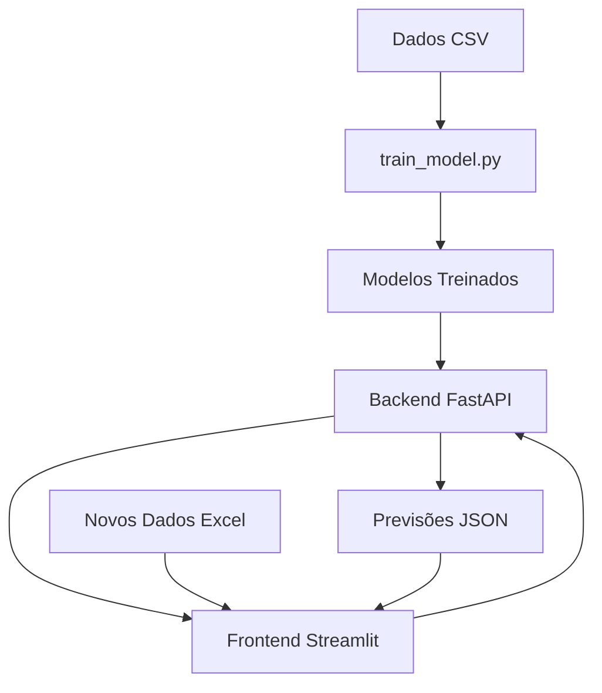

# Projeto de Dashboard e API de Previsão de Jogadores

Este projeto contém uma API de backend (FastAPI) para fazer previsões de machine learning e um frontend interativo (Streamlit) para visualizar dados e interagir com o modelo.

## Estrutura do Projeto

```
projeto/
├── .streamlit/
│   ├── config.toml
├── backend/
│   ├── main.py              # API FastAPI
│   ├── requirements.txt     # Dependências do backend
│   └── model_artifacts/     # Modelos treinados (gerado após treino)
├── frontend/
│   ├── dashboard.py         # Interface Streamlit
│   ├── requirements.txt     # Dependências do frontend
│   └── jogadores_com_clusters.csv
├── train_model.py           # Script de treinamento
├── JogadoresV1.csv         # Dados originais
├── docker-compose.yml      # Configuração Docker
├── Dockerfile.backend      # Dockerfile do backend
├── Dockerfile.frontend     # Dockerfile do frontend
└── README.md              # Este arquivo
```

## Guia de Instalação e Execução

Existem duas formas de executar este projeto: localmente ou com Docker.

### Opção 1: Executar com Docker (Recomendado)

Esta é a forma mais simples e consistente de executar a aplicação.

#### **Pré-requisitos:**
- Docker e Docker Compose instalados no seu computador
- O ficheiro de dados `JogadoresV1.csv` deve estar na pasta raiz do projeto

#### **Passos:**

**1. Treine o Modelo (Apenas uma vez):**
Antes de usar o Docker, você precisa gerar os ficheiros dos modelos. Execute este passo localmente.

```bash
# Se ainda não o fez, instale as bibliotecas necessárias
pip install pandas scikit-learn lightgbm joblib numpy

# Execute o script de treino
python train_model.py
```

> **Importante:** Isto irá criar a pasta `backend/model_artifacts` com os modelos treinados.

**2. Construa e Inicie os Contentores:**
Na pasta raiz do projeto (onde está o `docker-compose.yml`), execute:

```bash
docker-compose up --build
```

> **Nota:** O Docker irá construir as imagens para o backend e o frontend e iniciará ambos os serviços. Pode demorar um pouco na primeira vez.

**3. Aceda à Aplicação:**
- **Dashboard Streamlit:** [http://localhost:8501](http://localhost:8501)
- **API FastAPI (Documentação):** [http://localhost:8000](http://localhost:8000)

**4. Para Parar a Aplicação:**
No terminal onde executou o `docker-compose`, pressione `Ctrl + C`. Para remover os contentores:

```bash
docker-compose down
```

### Opção 2: Executar Localmente (Sem Docker)

Siga estes passos se não quiser usar o Docker.

#### **1. Treine o Modelo (Apenas uma vez):**
Siga o Passo 1 da secção Docker acima.

#### **2. Execute o Backend (API FastAPI):**

```bash
# Instale as dependências
pip install -r backend/requirements.txt

# Inicie o servidor
uvicorn backend.main:app --reload
```

> 🔗 A API estará disponível em `http://127.0.0.1:8000`. **Deixe este terminal aberto.**

#### **3. Execute o Frontend (Dashboard Streamlit):**

Abra um **novo terminal** e execute:

```bash
# Instale as dependências
pip install -r frontend/requirements.txt

# Inicie a aplicação
streamlit run frontend/dashboard.py
```

> O dashboard abrirá no seu navegador, normalmente em `http://localhost:8501`.

## Como Usar o Dashboard

### **Aba 1: Análise de Desempenho**
- Visualize métricas do modelo (RMSE, R²)
- Compare valores reais vs. previstos
- Filtre dados por clusters usando a barra lateral
- Analise a distribuição de jogadores por cluster

### **Aba 2: Previsão para Novos Jogadores**
- Carregue um arquivo Excel (.xlsx) com novos dados de jogadores
- Obtenha previsões de Target1, Target2, Target3 e cluster
- Visualize análises detalhadas por jogador
- Compare perfis individuais com médias do cluster

## Resolução de Problemas

### **Erro: "Arquivo 'jogadores_com_clusters.csv' não encontrado"**
Execute o script de treinamento primeiro: `python train_model.py`

### **Erro: "Não foi possível conectar à API"**
1. Verifique se o backend está em execução
2. Confirme se está acessível em `http://127.0.0.1:8000`
3. Se usando Docker, verifique se os contentores estão ativos: `docker-compose ps`

### **Erro: "Out of range float values are not JSON compliant: nan"**
O dashboard agora trata automaticamente valores NaN e infinitos. Se o erro persistir, verifique se o arquivo Excel não está corrompido.

### **Problemas com Filtros ou Seleção**
- Certifique-se de que há dados carregados
- Verifique se os clusters existem nos dados
- Recarregue a página se necessário

## Comandos Docker Úteis

```bash
# Ver logs dos contentores
docker-compose logs

# Ver logs apenas do backend
docker-compose logs backend

# Ver logs apenas do frontend
docker-compose logs frontend

# Reconstruir apenas um serviço
docker-compose up --build backend

# Parar e remover tudo (incluindo volumes)
docker-compose down -v
```

## Dependências Principais

### **Backend:**
- FastAPI
- scikit-learn
- LightGBM
- pandas
- numpy
- joblib

### **Frontend:**
- Streamlit
- plotly
- pandas
- scikit-learn
- requests

## Arquitetura do Sistema



## Notas Importantes

- **Primeira execução:** Sempre execute o treinamento do modelo primeiro
- **Dados de entrada:** Certifique-se de que o arquivo Excel tem as colunas esperadas
- **Performance:** O Docker pode usar mais recursos, mas oferece maior consistência
- **Desenvolvimento:** Use a execução local para desenvolvimento ativo com `--reload`

## Suporte

Se encontrar problemas:

1. Verifique se todos os pré-requisitos estão instalados
2. Confirme que o modelo foi treinado (`backend/model_artifacts` existe)
3. Verifique os logs dos serviços
4. Certifique-se de que as portas 8000 e 8501 não estão ocupadas

---
